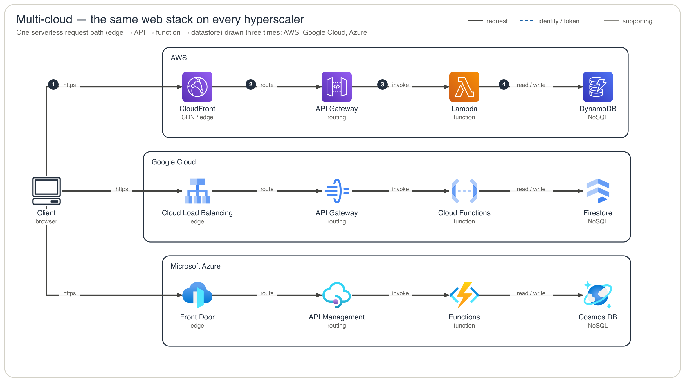

# drawing-skills

A small collection of **diagram / drawing skills** for [Claude Code](https://claude.com/claude-code) —
each a self-contained folder with a `SKILL.md` (and any helper scripts) that Claude loads on demand.

| Skill | What it does |
| --- | --- |
| [`architecture-skill`](architecture-skill/) | Generate clean **cloud-architecture diagrams across all hyperscalers** (AWS · Google Cloud · Azure) — official provider icons, left-to-right, elbow connectors, grouped zones, numbered request flow — as a self-contained SVG from a tiny declarative spec. |
| [`mermaid-check`](mermaid-check/) | Render → look → fix loop for **Mermaid** diagrams: rasterize, visually inspect for overlaps / parse errors, and fix the source so it survives strict renderers (GitHub, Azure DevOps wiki, Confluence). |

## architecture-skill at a glance

The same serverless web stack drawn on all three clouds — one declarative spec, official icons,
zero hand-drawn assets:



Icons are not bundled image files — each is a `(module, class)` reference into the
[`diagrams`](https://pypi.org/project/diagrams/) package, base64-embedded into the SVG at render time.
That's why supporting a new cloud or service is a one-line addition to the `_ICONS` table in
[`architecture-skill/_archviz.py`](architecture-skill/_archviz.py), and why the output SVG is fully
self-contained (renders inline on GitHub). The vocabulary ships **43 AWS · 30 GCP · 37 Azure** service
icons plus cloud-neutral actors/SaaS/tooling, in three parallel families (`s3` / `gcp_gcs` / `az_blob`, …).

## Installing the skills

Claude Code discovers skills under `~/.claude/skills/`. Symlink each one so edits in this repo take
effect immediately:

```bash
ln -s "$(pwd)/architecture-skill" ~/.claude/skills/architecture-skill
ln -s "$(pwd)/mermaid-check"       ~/.claude/skills/mermaid-check
```

(or copy the folders if you prefer a snapshot over a live link).

## Prerequisites

- **architecture-skill** — [`uv`](https://docs.astral.sh/uv/) (runs the renderer with the `diagrams`
  package on demand: `uv run --with diagrams python generate.py`). Optional `rsvg-convert`
  (`brew install librsvg`) for PNG rasters; macOS `qlmanage` works with no install.
- **mermaid-check** — `@mermaid-js/mermaid-cli` (`mmdc`) plus a headless Chrome for Puppeteer; see the
  self-heal block in [`mermaid-check/SKILL.md`](mermaid-check/SKILL.md).

## Regenerating the architecture example

```bash
cd architecture-skill
uv run --with diagrams python generate.py multicloud-example-spec.json .   # → multicloud-architecture.svg (+ .png)
```

Output is reproducible: the same spec yields a byte-identical SVG. Edit the spec, re-run — **never
hand-edit the SVG**.
