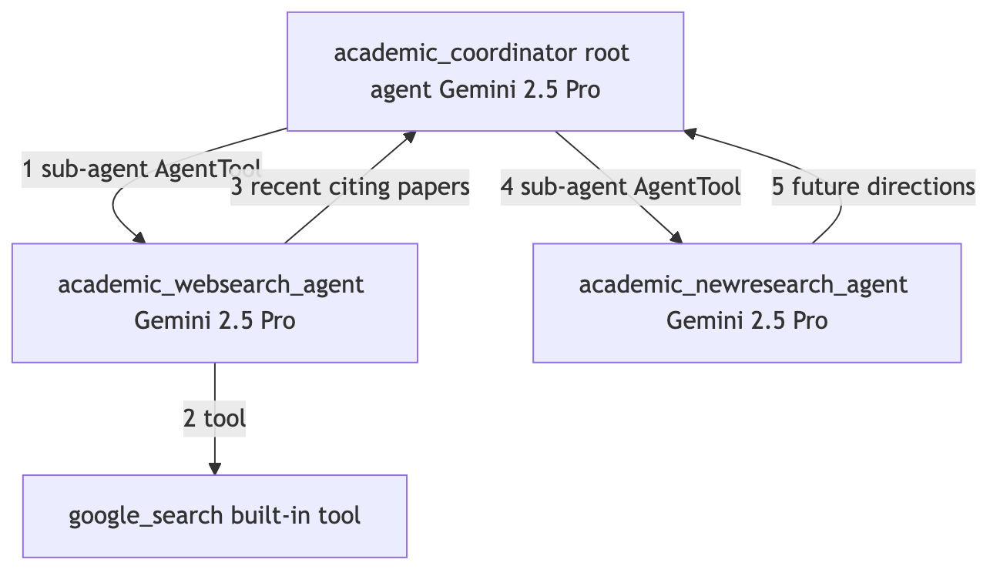
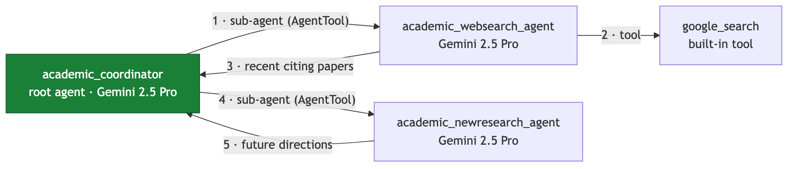
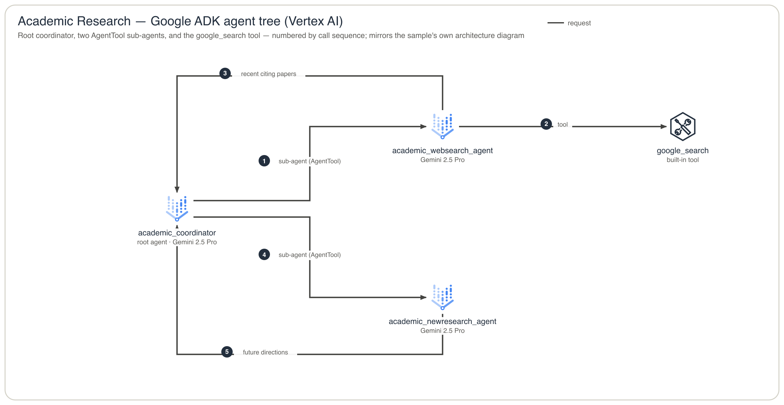

# drawing-skills

Two **diagram skills** for [Claude Code](https://claude.com/claude-code) that work together: sketch a
diagram in Mermaid, then turn it into a polished cloud-architecture diagram with real provider icons.

| Skill | What it does |
| --- | --- |
| [`mermaid-check`](mermaid-check/) | Renders a Mermaid diagram, *looks* at it, and fixes the source until it's clean and renders on GitHub. |
| [`architecture-skill`](architecture-skill/) | Turns a diagram into AWS / GCP / Azure **cloud-icon** architecture — as **SVG**, **PNG**, or editable **draw.io**. |

## Example

From a plain-English prompt to an editable cloud diagram in three turns — here, Google's
[`academic-research`](https://github.com/google/adk-samples/tree/main/python/agents/academic-research)
ADK agent. Just talk to Claude Code — each step feeds the next.

**1 · Sketch it as Mermaid**

> Draw a Mermaid diagram of the academic-research ADK agent — an `academic_coordinator` root agent
> that calls two AgentTool sub-agents, `academic_websearch_agent` (which uses `google_search`) and
> `academic_newresearch_agent`, each returning its result to the coordinator. Number the edges 1–5 in
> call order.



**2 · Clean it up**

> Use mermaid-check to render and fix that diagram.



**3 · Give it cloud icons**

> Use architecture-skill to render it as draw.io and PNG with cloud icons.



→ [`.drawio`](docs/academic-research-architecture.drawio) · [`.png`](docs/academic-research-architecture.png) · [`.svg`](docs/academic-research-architecture.svg) — everything lands in [`docs/`](docs/).

## Install

Claude Code loads skills from `~/.claude/skills/`. Symlink them so repo edits take effect live:

```bash
ln -s "$(pwd)/architecture-skill" ~/.claude/skills/architecture-skill
ln -s "$(pwd)/mermaid-check"       ~/.claude/skills/mermaid-check
```

## Prerequisites

**`uv`** — runs the architecture renderer. *(architecture-skill)*

```bash
curl -LsSf https://astral.sh/uv/install.sh | sh    # or: brew install uv
```

**`rsvg-convert`** — optional, for PNG output; SVG + draw.io work without it. *(architecture-skill)*

```bash
brew install librsvg            # macOS
sudo apt install librsvg2-bin   # Debian / Ubuntu
```

**Node + mermaid-cli** — the `mmdc` renderer behind mermaid-check. *(mermaid-check)*

```bash
brew install node                          # or download from https://nodejs.org
npm install -g @mermaid-js/mermaid-cli
```

**Headless Chrome** — `mmdc` needs a browser to render. *(mermaid-check)*

```bash
npx -y @puppeteer/browsers install chrome-headless-shell@latest --path ~/.cache/puppeteer
# point mmdc at the Chrome you just installed:
export PUPPETEER_EXECUTABLE_PATH="$(ls -d ~/.cache/puppeteer/chrome-headless-shell/*/chrome-headless-shell-*/chrome-headless-shell | tail -1)"
```

If `mmdc` ever says *"Could not find Chrome"*, just re-run those two lines.

## Adding an icon

Need a service that isn't drawn? Each icon is one line in the `_ICONS` table of
[`architecture-skill/_archviz.py`](architecture-skill/_archviz.py), mapping a short name to a class in
the [`diagrams`](https://pypi.org/project/diagrams/) package — e.g.
`"gcp_alloydb": ("diagrams.gcp.database", "AlloyDB")`. Add your line and ask the skill to render again.
The skill's [`SKILL.md`](architecture-skill/SKILL.md) has the class-lookup command and naming conventions.
